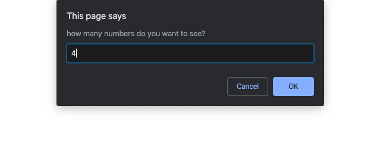
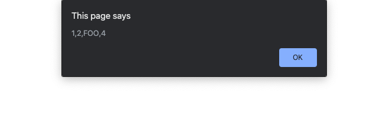

# FOOBAR Challenge

In this challenge, you will solve a problem that is commonly asked during the technical screening process and job interviews in the programming field: the Foobar problem.

The Foobar problem requires a foundation in programming and the coding language you’re using, which is why it often comes up in job interviews. Therefore, being able to solve this problem can help you land a job in the computer programming field.
This problem has its origins in a classroom game used to help students learn division, remainders, and fractions. In the game, students sit in a circle. The first student says the number 1, and then each student in the circle takes a turn saying the next number in a pattern. The catch is that for any number divisible by 3, the student should say “foo.” For any number divisible by 5, the student should say “bar.” Numbers divisible by both 3 and 5 are “Foobar.”
Here’s how a typical round of Foobar could start:
1, 2, Foo, 4, Bar, Foo, 7, 8, Foo, Bar, 11, Foo, 13, 14, Foobar, 16, 17, Foo, 19, Bar, Foo, 22, 23, Foo, Bar, 26, Foo, 28, 29, Foobar, 31, 32, Foo, 34, Bar, Foo, ...
Now for your challenge: write a program to play the Foobar game and display n elements of the Foobar pattern. Here are a few hints to get you started:

* First, prompt the user to enter how many digits in the pattern they want to see.
* Then, convert the number the user enters to an integer.
* Add the Foobar logic that will generate the specified number of digits in the pattern.

When we run the program, the user would see the following.

Let's enter 15 and press Enter.

We are presented with the first 15 items in the Foobar pattern:

But now let's say we entered 4 instead of 7.

In this case, we would be presented with this output:

Good luck on this difficult coding challenge!
